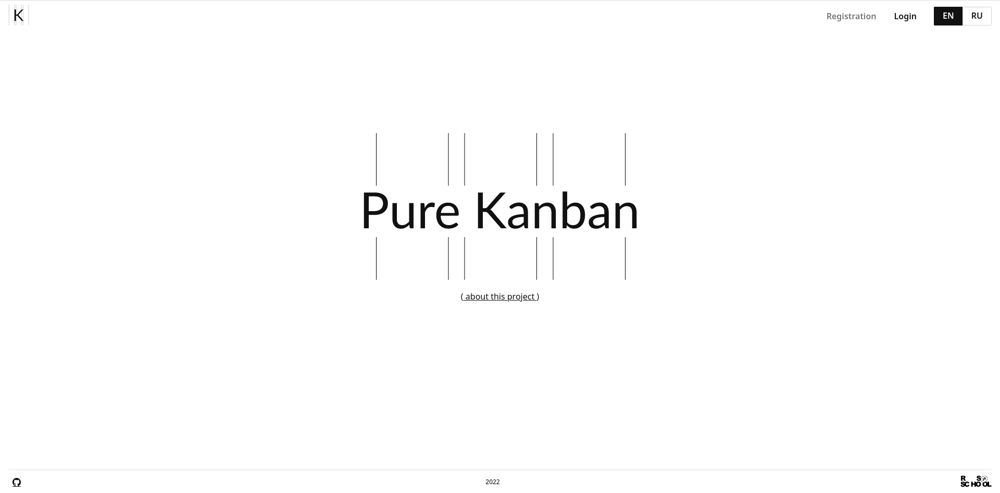

1. Task: https://github.com/rolling-scopes-school/js-fe-course-en/blob/main/tasks/angular/project-management-system.md
2. Screenshot: 
3. Deploy: [kanban-back.onrender.com](https://kanban-back.onrender.com/)
4. Score 620/620
5. Done 26.11.2022 / 27.11.2022

**Welcome route +70**
   * [x] The welcome page should contain general information about the developer, project, and course. (10)
   * [x] In the upper right corner there are 2 buttons: login and sign up. (10) 
   * [x] If there is an unexpired token, the user should be redirected to the "Main route" of the application automatically. (20)  
   * [x] When the token expires - the user should be redirected to the "Welcome page" automatically. (20)    
   * [x] Pressing the Login / Sign up button redirects a user to the route with the Login / Sign up form. (10)
  
**Login / Sign up +80**
   * [x] Login/log out should be present on all pages. (20)
   * [x] Form fields should be implemented according to the backend API. Validation should be implemented. (50)
   * [x] Upon successful login, the user should be redirected to "Main route". (10)

**Main route +100**
   * [x] Board creation functionality. (20)
   * [x] Displays all created boards as a list. (10)
   * [x] Each board in the list is displayed with a small preview of available information (title, description, etc). By clicking an element the user navigates to the board item (Board route). There's also a button for board deletion. (10)
   * [x] When trying to delete the board, we should receive a confirmation modal. The confirmation modal must be a generic component (one for the entire application). (10)
   * [x] Global search (optional): we implemented boars search and task search in boards. (20)
   * [x] The user profile editing functionality is implemented. (30)

**Board route +260**
   * [x] Button for column creation is displayed. (10)
   * [x] If a board contains at least one column - a button for task creation is displayed as well. (10)
   * [x] A modal window with form is displayed for column and task creation. (30)
   * [x] A vertical scrollbar is displayed in the column when overflowing with the number of column tasks. (20)
   * [x] The page itself on the current route doesn't have a vertical scrollbar. (10)
   * [x] With the help of drag-n-drop, we can swap columns. (30)
   * [x] With the help of drag-n-drop, we can change the order of tasks within a column. (30)
   * [x] With the help of drag-n-drop, we can change the task belonging to the column. (50)
   * [x] by clicking on the task, we open a modal window with the edit task form. The requirements for the form and window are the same as everywhere else. (30)
   * [x] The task must have a delete task button. On click: confirmation modal -> delete. (10)
   * [x] The top of a column should always display the column title. By clicking the title the test should turn into a form with cancel and submit buttons. After typing a text into the input and clicking the submit button the tile of the column should be updated. (20)
   * [x] The column should have a delete button. By clicking -> confirmation modal -> when approving -> deleting. (10)

**General requirements +80**
   * [x] Backend error handling - (Not found, unhandled rejection, etc) should be performed in a user-friendly way (toast, pop-up or anything else you implement). (50)
   * [x] Localization. (20)
   * [x] Backend is deployed and publicly available. (10)

**Additional functionality +30**
   * [x] Boards search and task search in boards. See above in Main route.
   * [x] Custom preloader is implemented. (30)

